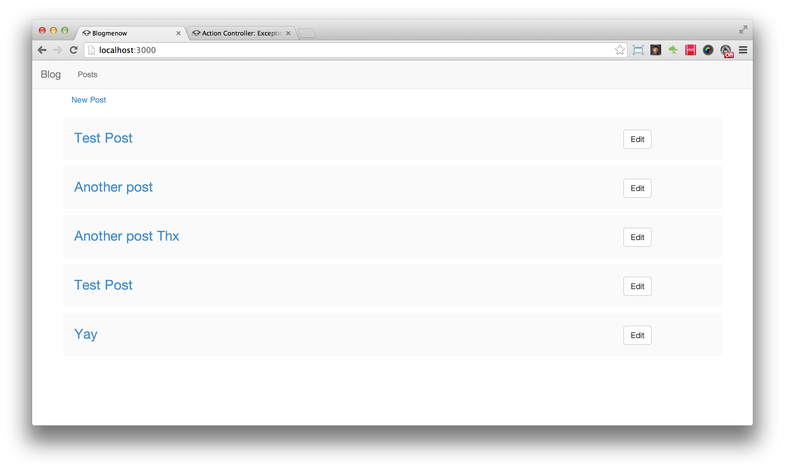
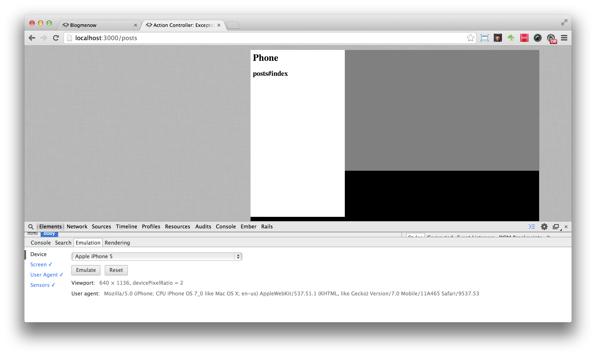

In this episode we show you how to use the brand new Rails 4.1 feature called 'Variants'

Variants is a way of selecting different templates to render based on which device is accessing the application. This can be very handy when you don't want to muck about with responsiveness.

Generally having a separate template is preferable since it means you can completely isolate your desktop UI from the mobile UI, giving you more flexibility.

You can load up the Desktop UI with all the snazzy javascript libraries. While having very specialized lightweight ones for the mobile.

I feel that this way of working with mobile devices is much cleaner than using one template and hacking it using 'responsiveness'.

To get started we'll need to implement the method that will let us set which variant we are going to use based on the device that's accessing our application.

In `application_controller.rb`

```ruby
def set_device_format
  request.variant = :phone if browser.mobile?
end
```

We use the `browser` gem to detect which kind of device is accessing our application and select the `variant` by setting it using `request.variant = :phone`

All we need to do now is run this method before our action runs

```ruby
before_action :set_device_format
```

Our `application_controller.rb` should look something like this

```ruby
class ApplicationController < ActionController::Base

  before_action :set_device_format

private

  def set_device_type
    request.variant = :phone if browser.mobile?
  end

end
```

Once we've set this up in our controller now we need to create templates in our views to support this `:phone` variant.

The way we do that is we simply create a new layout for the phone.

```bash
app/views/layouts/application.html+phone.erb
```

Add the following content to your application layout

```html
<h1>Phone</h1>
<%= yield %>
```

You'll also need a template for the action so go ahead and create a view for the controller

```bash
app/views/posts/index.html+phone.erb
```

Add the following content to your index template

```html
<h2>posts#index</h2>
```

So now you'll have 2 index templates. One for the good'ol browser and one for the phone variant.

Once its all setup you should see these in your browser.



And when you have the phone emulation on you should see something like this



Congratulations you are now using the variants feature to render out different template based on your device.