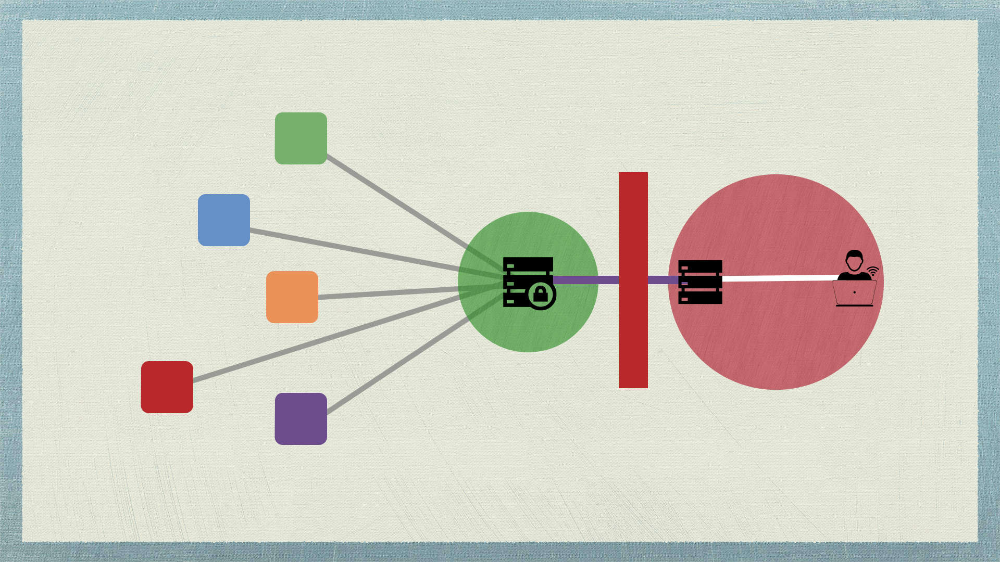
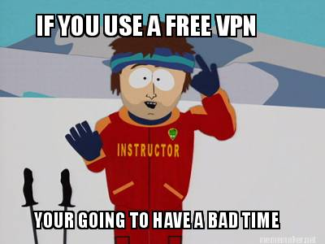

With the recent events in our country, I've decided that it would be a good idea to talk about about VPNs.

VPN is short for Virtual Private Network. What it allows you to do is to connect to remote networks through the internet. Usually its used by companies to allow people within the company to securely access their files and share files amongst each other. However its application goes beyond that. VPNs have now become ubiquitous and are now embraced even by consumers / regular home internet users.

## Why would you want to use a VPN?

There are several reasons why one would want to use a VPN.

+ Access blocked content from certain geographic regions
    +  An example of this is, if you want to access sites like netflix or hulu in the US.

+ Access content that is blocked from your country
    + So you're like me and live in a country where your government is now blocking any site they feel is inappropriate for their personal agenda, or they just woke up on the wrong side of the bed one day and saw something on their daughter's facebook page that pissed them off that day. VPNs will allow you to become uncensored.

+ Securely access data
    + This one is another big reason, basically everything you access through a vpn is encrypted since you connect with your vpn through a certificate that is signed by the server only your computer can understand the messages from your VPN server.

## How does a VPN work?

Your computer connects to a vpn using a special port and a certificate that is signed by your VPN server. Essentially this creates a secure 'tunnel' that gives you a persistent connection to your VPN server. Making your computer a node on the private network.

### Internet Gateway

An internet gateway is how your computer is connected to the global network. Its how the world sees your computer and vice versa. 

When you connect to an ISP they act as your internet gateway. Which means they can choose which sites you can or can't see. They can have a blacklist of websites that you are not allowed to access. Thats basically how internet censorship is done.

Most websites have an address we call the "IP" address. This is google.com's IP address `173.194.117.33`.

So all your ISP has to do to block you access to google.com is just add that IP address to the blacklist. Scary thought right?

So how does a VPN give you access to sites that have been blocked by your ISP? Well very simple. You can use your VPN as the internet gateway instead of using your ISP. That means you control your own destiny. Provided your ISP doesn't block your VPN's IP addresses.

### Public / Private / Free VPNs

There are many kinds of VPNs. You can use, a free solution, a public paid VPN or setup your own private VPN. I strongly recommend against using free VPNs since they're usually overloaded with users so your going to be sharing CPU / memory / bandwidth with hundreds of thousands of users.

Paid services are better since they control the quality of the connection, they ensure not too many people are connecting to one server, and if a server is becoming overloaded they'll balance the traffic between their servers to ensure good / great quality of service.

The great thing about these paid services is they have servers in a variety of location that you can connect to. So if you want to stream content from the US you simply connect to their US server. Paid services still have a few problems though, your still sharing the bandwidth with hundreds of users and there is still a risk of the government blocking the service because since there is a higher chance of them knowing about it. For example Hot Spot Shield is blocked in Thailand.

Another way of accessing a VPN is to run your own. Thats right you can setup and run your own private VPN. If your like me and you need something reliable and fast then a private VPN is probably the best way to go. There is no risk of getting blocked because only you know the ip address of your VPN (unless you share it with hundreds of people). Its a private service, which means you don't need to share the bandwidth or computational resources with anyone. You have the server all to yourself. 

Whats the down side? Well you no longer have the variety of server locations to choose from (unless you set one up in different locations) that you had with a paid service. If you are choosing to use a VPN so you can watch movies / shows from the US you will need to setup your server in the US. With your server in the US your latency becomes an issue (if your living in Asia) which means your internet performance isn't going to be that great. 

The best thing to do provided you don't care about accessing US media sites is to setup a VPN in a location thats physically near you. For example I live in Thailand which means the best location for a VPN for me is Singapore.

## Final Thoughts

If you run an internet business in a country where you could lose access to popular services like facebook, youtube, twitter any time then its probably smart for you to have some sort of VPN as a backup. [Codemy.net](http://codemy.net) runs a hotel booking service called [Yoobook.it](http://yoobook.it) that uses facebook for logins. Which means our service depends very much on facebook working. Unfortunately if you live in a country where the leader doesn't understand the significance of the internet then a VPN is an essential tool for your organization.

Having a fast and reliable VPN service could mean the difference between losing or saving your business in this day and age.

