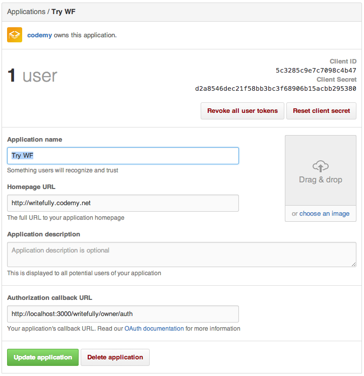

In this video we show you how to get started using writefully for your content focussed project.

## Notes From the Video

Note the Authorization Callback URL for development. Generally we recommend having different github app for production and development environment. Obviously in your production server you would use your server's domain name and not `localhost:3000`

