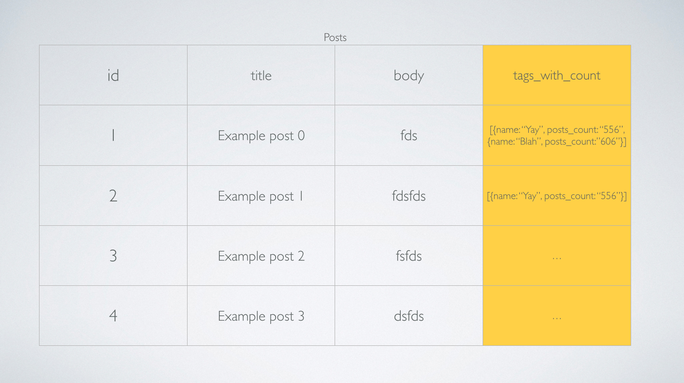
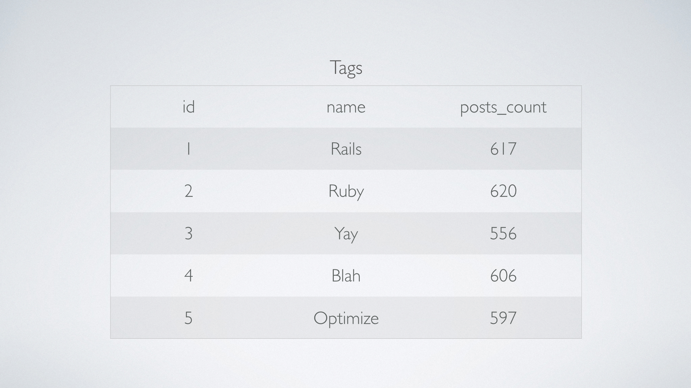
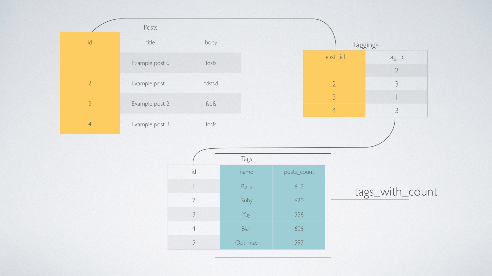

To get the most out of your database you'll need to be able to build your own queries. Ruby on Rails comes with AREL, a query builder. 

ActiveRecord utilizes AREL to help build queries before it is executed by the database. To access arel you can use the class method `#arel_table`. For example

```ruby
Post.arel_table
```

Once you have access to the AREL table you can build any kind of query you need.

We will use our example as a case study for building custom queries.

In our case, the goal we are trying to a achieve is a collection of posts, with a `tags_with_count` field that contains an array of hashes. Inside the hash we have the name of the tag and the `posts_count` of each of the tag for that post.



If we can get this as the result when we execute the query, all the view has to do is render out each post and we can access the `tags_with_count` as just another method call because of ActiveRecord's ORM magic.

Lets break down all the things we need to do to achieve this result.

## 1. Generate the tags table with posts_count



We need to use this table instead of the one we have in our database.

To generate this table we can use something we learned in the [second episode](http://www.youtube.com/watch?v=rJg3I-leoo4) of this N+1 series.

```ruby
def tags_with_posts_count
  Tag.joins(:posts)
       .select("tags.*, COUNT(posts.id) AS posts_count")
         .group("tags.id")
end
```

However since we are now going to use this table as a part of a bigger query we need to use AREL syntax for building the query to avoid problems.

```ruby
"tags.*" 
```

becomes

```ruby
Tag.arel_table[Arel.star]
```

Arel also comes with a way to help us run database functions like `COUNT`

```ruby
"COUNT(posts.id) AS posts_count"
```

becomes

```ruby
Arel::Nodes::NamedFunction.new("COUNT", [arel_table[:id]]).as('posts_count')
```

and finally

```ruby
"tags.id"
```

becomes 

```ruby
Tag.arel_table[:id]
```

The final refactored query will be

```ruby
def tags_with_posts_count
  Tag.joins(:posts)
       .select(Tag.arel_table[Arel.star], Arel::Nodes::NamedFunction.new("COUNT", [arel_table[:id]]).as('posts_count'))
         .group(Tag.arel_table[:id]).as('tags')
end
```

We need to add `as('tags')` at the end because the result of this query will replace the `tags` the actual table in our database.

## 2. Get the tags with posts_count for each post

We can do this using the `taggings` join table that joins the `tags` with the `posts`



The query for getting the tags for each post looks like this 

```ruby
def tags_from_taggings
  Tag.joins(:taggings)
       .select(Tag.arel_table[:name], Tag.arel_table[:posts_count])
         .from(tags_with_posts_count)
           .where(Tagging.arel_table[:post_id].eq(arel_table[:id])).as('tag')
end
```

### Breakdown

Lets break this down line by line

```ruby
Tag.joins(:taggings) # we do this because we want to get the tags using the `taggings` table
```

```ruby
select(Tag.arel_table[:name], Tag.arel_table[:posts_count]) # So we can select the columns we want
```

```ruby
from(tags_with_posts_count) # this one is obvious, this is where we call our previous query
```

```ruby
where(Tagging.arel_table[:post_id].eq(arel_table[:id])) # we tell the query that we want the tag_id where the `taggings.post_id = posts.id`
```

```ruby
as('tag') # we're saying to assign the result as 'tag' so we can reference it later
```

## 3. Convert the 'tag' into hstore

Once we have our `tag` for our post we want to convert the data into hstore, to achieve that we use

```ruby
def tags_hstore
  Tag.arel_table.project(Arel.sql('hstore(tag)')).from(tags_from_taggings)
end
```

The `project` method in AREL is equivalent to `select` for active record, but since we are using AREL we have to use `project`. So basically we're saying we want to `select("hstore(tag)").from(tags_from_taggings)`

## 4. Store the Matching Tags in an Array

Once we get the resulting tags as hstore, we need to store them in an array because there could be multiple matchings tags for each post. To achieve this we do

```ruby
  def array_of_tags_hstore
    Arel::Nodes::NamedFunction.new("ARRAY", [tags_hstore]).as("tags_with_count")
  end
```

## Putting it Together

Once we put together the queries we get something like this

```ruby
scope :with_tags_and_count, -> { select([arel_table[Arel.star], Post.array_of_tags_hstore]) }
 
class << self
  def array_of_tags_hstore
    Arel::Nodes::NamedFunction.new("ARRAY", [tags_hstore]).as("tags_with_count")
  end

  def tags_hstore
    Tag.arel_table.project(Arel.sql('hstore(tag)')).from(tags_from_taggings)
  end

  def tags_from_taggings
    Tag.joins(:taggings)
         .select(Tag.arel_table[:name], Tag.arel_table[:posts_count])
           .from(tags_with_posts_count)
             .where(Tagging.arel_table[:post_id].eq(arel_table[:id])).as('tag')
  end

  def tags_with_posts_count
    Tag.joins(:posts)
         .select(Tag.arel_table[Arel.star], Arel::Nodes::NamedFunction.new("COUNT", [arel_table[:id]])
           .as('posts_count')).group(Tag.arel_table[:id]).as('tags')
  end
end
```

All we have to do is put this code into the `Post` model and we can call the scope from our controller.