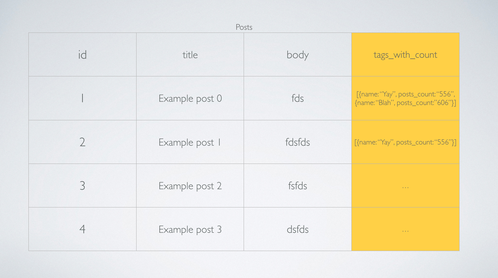

To get the most out of your database you'll need to be able to build your own queries. Ruby on Rails comes with AREL, a query builder. 

AREL is a little known feature amongst Ruby on Rails developers. In this episode we will introduce you to some basics behind AREL.

ActiveRecord utilizes AREL to help build queries before it is executed by the database. To access arel you can use the class method `#arel_table`. For example

```ruby
Post.arel_table
```

Once you have access to the AREL table you can build any kind of query you need.

We will use our example as a case study for building custom queries.

In our case, the goal we are trying to a achieve is a collection of posts, with a `tags_with_count` field that contains an array of hashes. Inside the hash we have the name of the tag and the `posts_count` of each of the tag for that post.



If we can get this as the result when we execute the query, all the view has to do is render out each post and we can access the `tags_with_count` as just another method call because of ActiveRecord's ORM magic.

Lets break down all the things we need to do to achieve this result.

